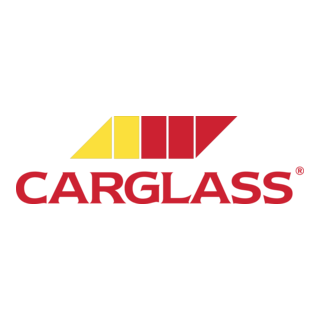

<div align="center">
  
  <h1>Carglass.DivisorPrime.Api</h1>
</div>
## 📝 Sobre o Projeto

O **Carglass.DivisorPrime.Api** é uma API backend desenvolvida para calcular os divisores e divisores primos de um número informado. O projeto foi estruturado com foco em qualidade, seguindo boas práticas de desenvolvimento, princípios de Clean Code e padrões de design.

---

## 🛠️ Tecnologias Utilizadas

- **ASP.NET Core** para construção da API.
- **Moq** para testes unitários.
- **ILogger** para gerenciamento de logs.
- **Swagger** para documentação interativa.

---

## 🏗️ Estrutura do Projeto

Este projeto foi desenvolvido utilizando boas práticas de arquitetura, princípios de Clean Code e padrões de design para garantir qualidade, extensibilidade e manutenção simplificada. Abaixo estão os principais conceitos e padrões aplicados:

### 🔗 Camadas e Separação de Preocupações

- **Domain:** Contém DTOs e enums para transferência de dados e padronização de respostas.  
- **Service:** Implementa lógica de negócios (manipuladores, validadores e serviços).  
- **Mappers:** Centraliza a construção de respostas (ex.: `ResponseBuilder`).  
- **API:** Gerencia configuração e integração, incluindo middlewares.

### 🧩 Padrões de Design

- **Injeção de Dependência:** Configurada em `DependencyInjection.cs` para desacoplamento e modularidade.  
- **Service Layer:** Centraliza a lógica de negócios em serviços como `DivisorService`.  
- **Builder Pattern:** Utilizado em `ResponseBuilder` para criação padronizada de respostas.  
- **Strategy Pattern:** Aplicado aos manipuladores (`IDivisorHandler`, `IPrimeDivisorHandler`) para encapsular algoritmos.  
- **Middleware:** `RequestLoggingMiddleware` para tratamento transversal de logs.

### 🧼 Princípios de Clean Code

- **Nominação Significativa:** Classes e métodos têm nomes descritivos e claros (ex.: `PrimeDivisorHandler.Handle`).  
- **Código Simples e Modular:** Funções pequenas, focadas e sem duplicação de lógica.  
- **Tratamento de Erros Elegante:** Respostas padronizadas para diferentes cenários, como validação e erros inesperados.

### ✅ Boas Práticas de Desenvolvimento

- **Testes Unitários:** Extensivamente implementados com mocks (`Moq`) para garantir cobertura e isolamento de dependências.  
- **Observabilidade:** Uso de `ILogger` para logs detalhados de eventos importantes.  
- **Enums para Padronização:** Ex.: `ApiHttpStatusCode` para uniformizar status HTTP.

Esses elementos combinados garantem que o projeto seja robusto, fácil de entender, testar e expandir.

---

## ⚙️ Configuração do Projeto

1. Clone este repositório:
   ```bash
   git clone https://github.com/flavio-santos-ti/Carglass.DivisorPrime.Backend.git
